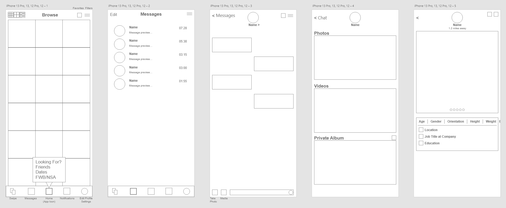

# Hook App
## Project Overview
The major features of the web application will be to create/authenticate users and provide them a list of three options based on their disire. The UI will change the color palette of the site as well as filter the grid to people searching for the same thing i.e. looking to make friends. Users will be able to view the grid based on distance and filter based on profile attributes. Additionally the users can view profiles of other users and send messages.
The problem the app is attempting to address is providing all basic features for free to users instead of using a predatory model like some existing apps to maximize their bottom line. Apps like Grindr have gone from $0.99 a month for a subscription to $40 a month just to get some more advanced filtering and viewing more profiles. 

## Functionality
A new user will hit the landing page and be prompted to sign in or register. The registration will walk them through creating a username and password, completing basic information to load into their profile, and upload pictures. Once completed the user will submit and be routed to the home page where a grid of other users is displayed based on location in proximity to the logged in user. The default mode will be set to Friends for first time users and allow them to change to either Dates or Hookups. Based on the selected mode, the UI will change the color palette to the respective mode following color theory for each mode's intent. From here users can select and interact with the profiles of other users.

## Data Models
### User Extended Model
    - First Name
    - Last Name
    - Email
    - Password
    - About Me
    - Gender Identity
    - Sexual Orientation
    - Out: Yes/No
    - Location
    - Date of Birth
    - Age
    - Ethnicity
    - Height
    - Weight
    - Body Type
    - Exercise
    - Drinking
    - Smoking
    - Marijuana
    - Drugs
    - Pets
    - Kids
    - I Am
    - You Are
    - Kinks
    - Religion
    - Politics
    - Education
    - Star Sign
    - Myers Briggs
    - Love Language(s)
    - Instagram
    - Facebook
    - LinkedIn
    - TikTok
    - Twitter
    - PSN
    - Steam
    - Switch
    - Xbox
### Gender Identity Model
    - Man
    - Non-Binary
    - Trans Man
    - Trans Woman
    - User Input
### Sexual Orientation
    - Asexual
    - Bisexual
    - Curious
    - Gay
    - Pansexual
    - Straight
    - User Input
### Tribe Model
    - Bear
    - Chub
    - Clean-Cut
    - Cub
    - Daddy
    - Discreet
    - Gaymer
    - Gym Bunny
    - Leather
    - Otter
    - Twink
    - Wolf
### Sexual Preference
    - Bottom
    - Vers Bottom
    - Versatile
    - Vers Top
    - Top
    - Oral
    - Fetish
### Kink Model
    - Armpits
    - Ask Me
    - BDSM
    - Beards
    - Bondage
    - Chastity
    - Cock Ball Torture (CBT)
    - Diapers
    - Dom
    - E-Stimulation/Electrical Play
    - Feet
    - Fisting
    - Furry
    - Leather
    - Master
    - Muscle Worship
    - Nipples
    - Rubber
    - S&M
    - Skinheads
    - Slave
    - Socks
    - Spit
    - Sports Gear
    - Sub
    - Switch
    - Tattoos/Piercings
    - Uniforms
    - Used Underwear
    - Watersports
    - User Input
## Schedule & Milestones
    Week 1: User Creation and Authentication
    - Create Django Project and User App
    - Create SuperUser
    - Create Models
    - Create Registration Form
    - Create Login
    - Create Logout
    - Testing
    Week 2: Home Page and Loading User Profiles into the Grid
    - Create Index
    - Create Home Page
    - Load Users into Grid
    - Testing
    Week 3: Profile Page
    - Create Profile Page
    Week 4: UI/UX
    - Cleanup and Apply UI/UX
## Reference Photos for Mobile View
